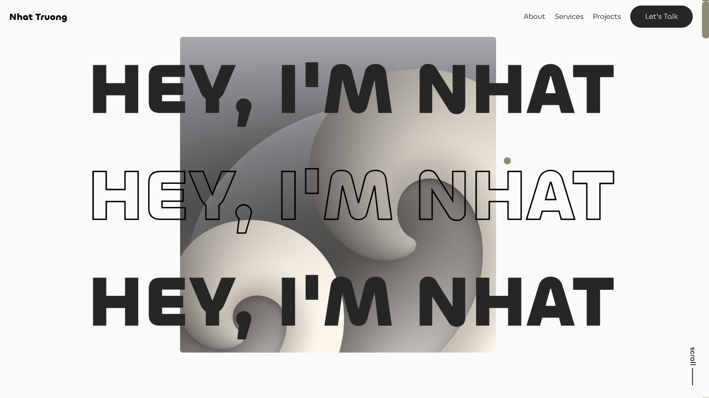

Link to my portfolio [Portfolio](https://fleeforezz.me).

## Srceenshot


## Getting Started

First, install node module:
```bash
npm install
```

Then, run the development server:

```bash
npm run dev
# or
yarn dev
# or
pnpm dev
# or
bun dev
```

Open [http://localhost:3000](http://localhost:3000) on your browser.

## Pull Docker image

```bash
docker pull fleeforezz/portfolio
docker run --name portfolio -p 9463:9463 -d fleeforezz/portfolio:latest
```

## Docker compose

```bash
git clone https://github.com/fleeforezz/Portfolio.git
sudo docker-compose up -d
```